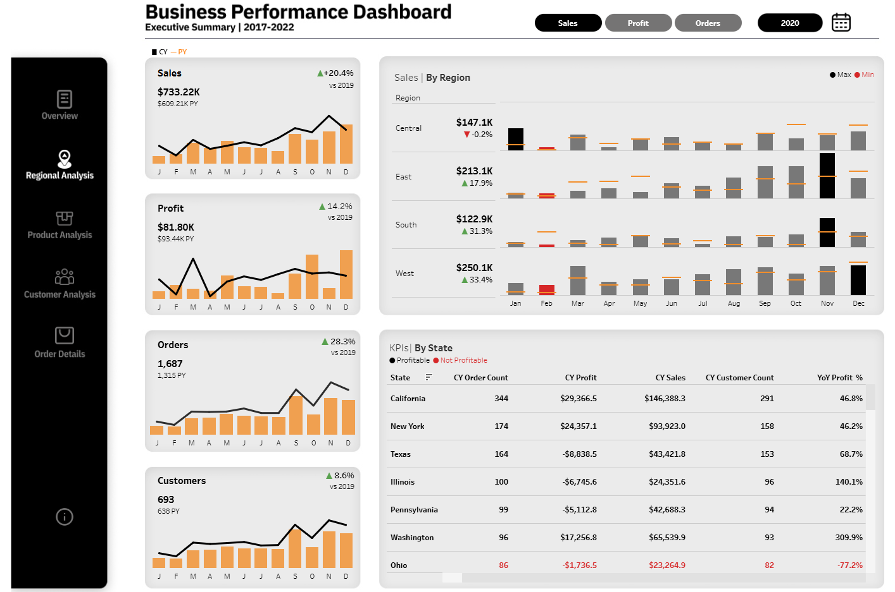

# Business Performance Dashboard
For interactive dashboard experience click [here](https://public.tableau.com/app/profile/anjali.hansda/viz/BusinessPerformanceDashboard_17453320018590/Overview)

## Project Overview
This project is a comprehensive and interactive Business Performance Dashboard developed for an online retail store. It is designed to help stakeholders gain a clear understanding of key business metrics across regions, product categories, and customer segments over time. The dashboard enables users to compare current year (CY) and previous year (PY) performance with year-over-year (YoY) growth rates. offering valuable insights into trends and business progress. It features dynamic metric selection, allowing users to toggle between sales, profit, and orders based on their analytical needs. Additionally, it includes intuitive drill-down capabilities that provide granular views by geography, product lines, and customer segments.

## Metrices
 The following metrics and visualizations are included across the five key sections:

**1. Overview**

- **Total Sales/Profit/Orders/Customers (CY vs PY):** Overall business performance compared to the previous year.
- **YoY Growth Rates:** Measures year-over-year percentage change to highlight business growth or decline.
- **Sales/Profit/Orders by State with Top Cities on Hover:** Understand geographic distribution and pinpoint high-performing cities.
- **Sales/Profit/Orders by Customer Segment:** Identifies which customer types contribute most to business outcomes.
- **Sales/Profit/Orders by Product Category:** Reveals trends and disparities across product lines.
- **Sales/Profit/Orders by Region:** Reveals trends and disparities across geographic areas.
- **Top 10 Product Sub-Categories:** Highlights the most successful product segments in a ranked format.

**2. Regional Analysis**

- **Regional Performance (CY vs PY):** Compares sales, profit, orders, and customer count across regions.
- **Regional YoY Growth Rates:** Measures growth by region to identify market trends and regional opportunities.
- **Monthly CY vs PY Sales/Profit/Orders by Region:** Helps track seasonal patterns and regional demand shifts.
- **State-Level Performance Table:** Provides granular performance data for each state including order count, profit, sales, customer count, and YoY profit %.

**3. Product Analysis**

- **Product Category Performance (CY vs PY):** Evaluates how different product lines are performing year over year.
- **YoY Growth by Product Category:** Shows which categories are expanding or declining.
- **Sales/Profit/Orders by Product Category with Hover to Sub-Category:** Enables deep dives into product performance at both macro and micro levels.
- **Monthly CY vs PY Product Trends:** Reveals product demand fluctuations across the year.
- **Top X Products Table:** Ranks the set number of top-performing products by order count, sales, profit, and customer reach.

**4. Customer Analysis**

- **Customer Segment Performance (CY vs PY):** Measures how each customer type is contributing to overall business.
- **YoY Growth by Customer Segment:** Identifies emerging or declining customer segments.
- **Monthly Trends by Customer Segment:** Tracks engagement and revenue trends across customer groups.
- **Top X Customers with Order Count by Customer on Hover:** Identifies the set number of high-value customers and and pinpoint their historical engagement.
- **New vs. Repeat Customer Line Chart:** Provides visibility into acquisition vs. retention dynamics.

**5. Order Details**

- **Weekly Order Trends:** Captures operational tempo and demand cycles at a granular level.
- **Detailed Order Table:** Lists order-level data for operational analysis and audit purposes.

## Dashboard Features

- **Dynamic Metric Selection:** Toggle between key metrics—Sales, Profit, Orders—across all visualizations.

- **Custom Year Selection:** Choose which year to set as the Current Year (CY) for comparison with Previous Year (PY).

- **Interactive Drill-Downs & Hover Interactions:** Hover to explore deeper insights like data by region, state, city, product category, sub-category, and individual customers.

  
- **Customizable Top Products/Customers:** Users can adjust the number of top products and customers displayed in tables (via a slider).

